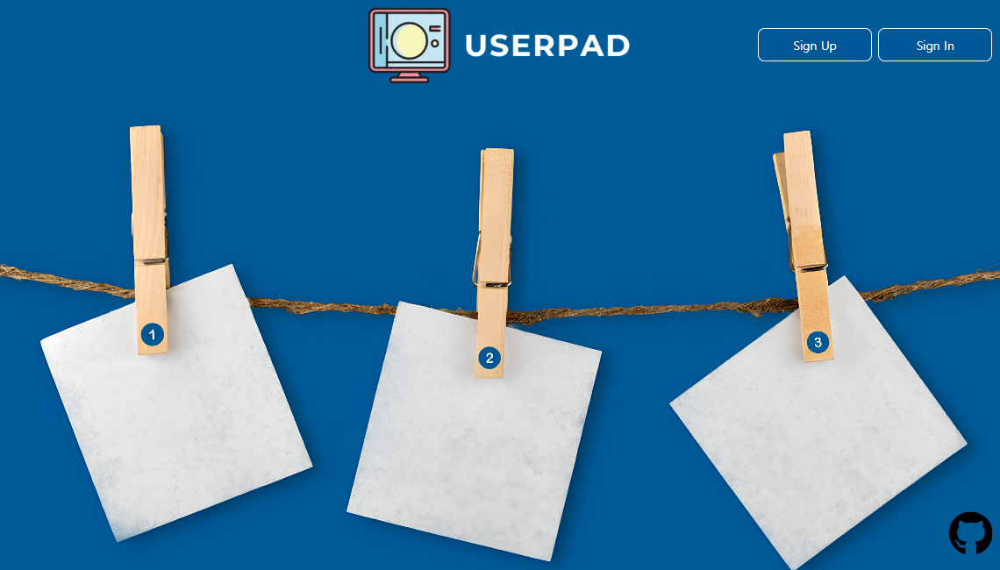
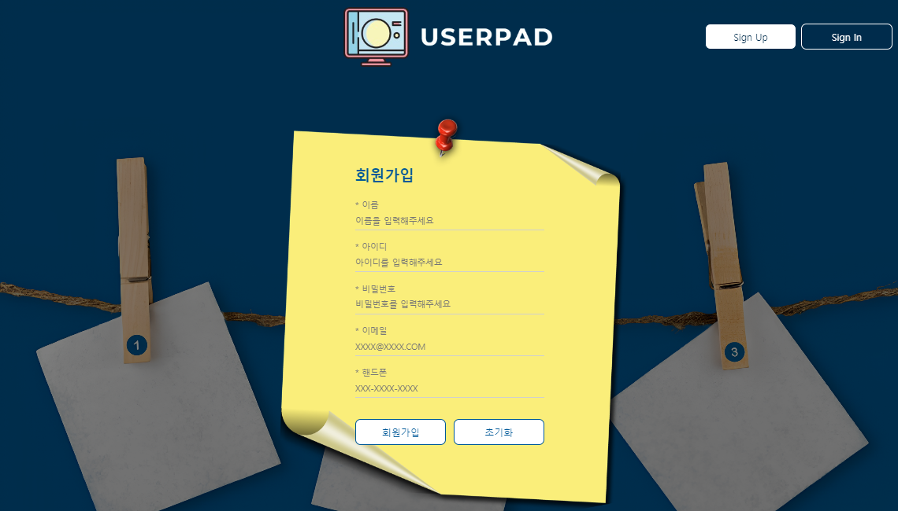
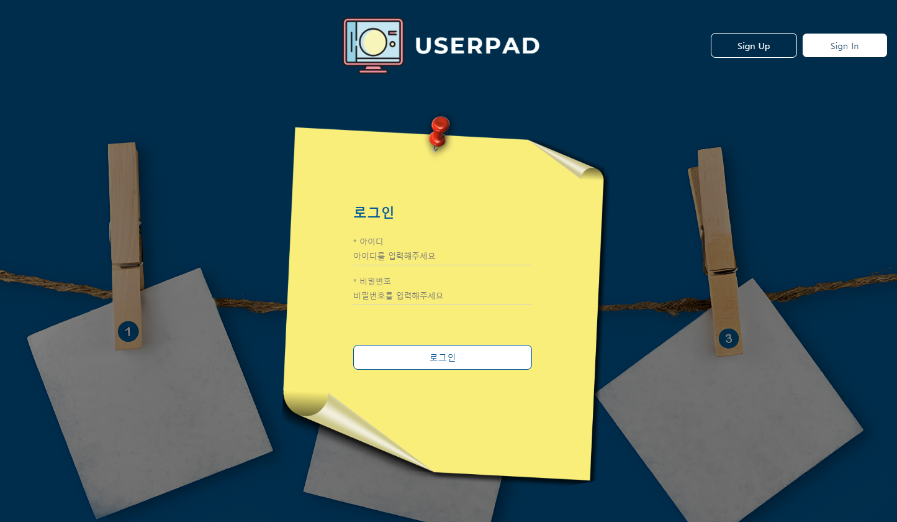
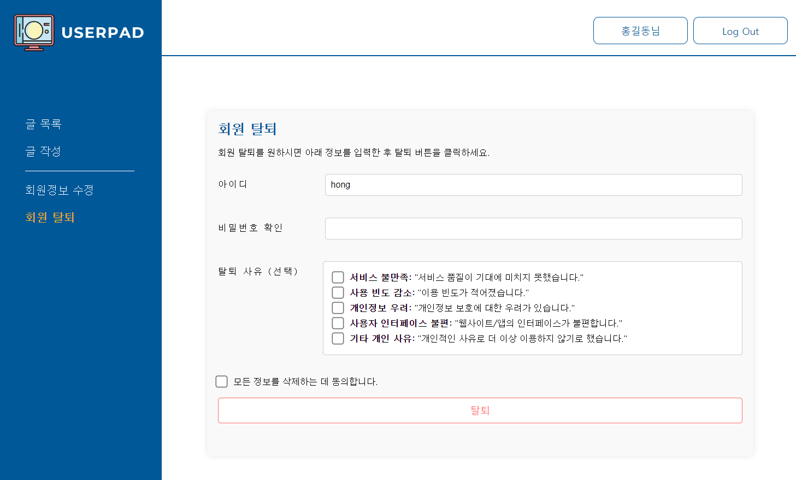
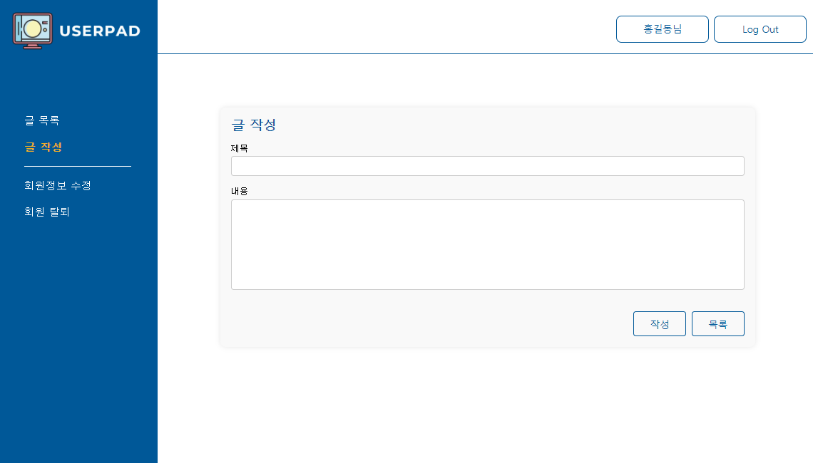
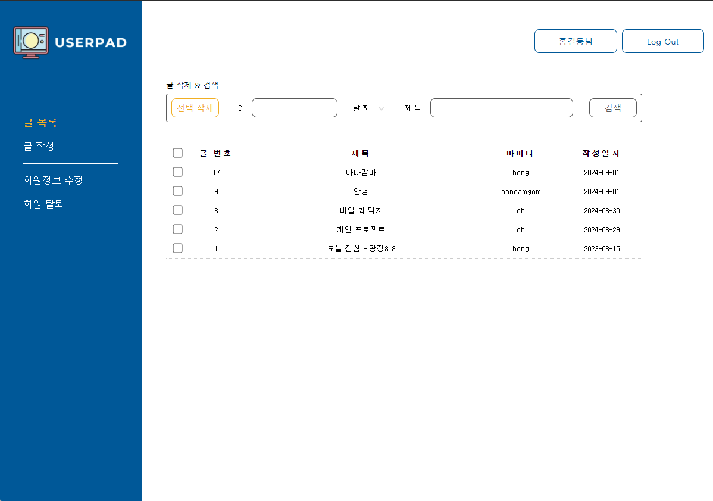
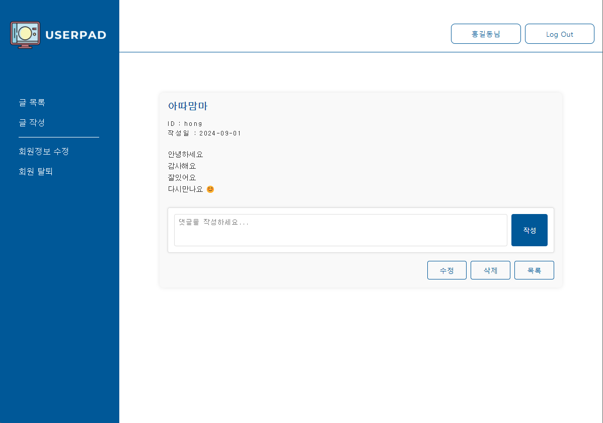
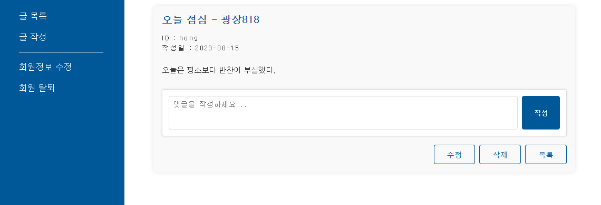
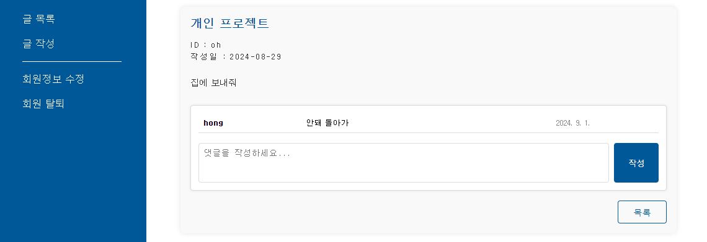

# UserPad


**UserPad**는 사용자들이 자유롭게 의견을 나누고 정보를 공유할 수 있는 웹 기반 게시판 시스템입니다. 이 시스템은 사용자가 다양한 주제로 게시글을 작성하고, 댓글을 통해 활발한 토론을 할 수 있게 도와줍니다. 본 시스템은 커뮤니티 사이트, 고객 지원 포럼, 팀 프로젝트 협업 공간 등 다양한 용도로 활용될 수 있습니다.


## 🛠️ 개발 환경

- **프로그래밍 언어**: HTML, CSS, JavaScript
- **IDE**: Eclipse (jdk-17)
- **DBMS**: Oracle Database
- **SQL 툴**: SQL Developer
- **버전 관리**: Git


## 📰 Database

- **USERS**: 회원 정보 테이블
  ```sql
   -- 테이블 생성
    create table user (
   	 name VARCHAR2(20) NOT NULL,
   	 id VARCHAR2(30) PRIMARY KEY, -- 무결성 제약조건, not null
   	 pwd VARCHAR2(50) NOT NULL,
   	 email VARCHAR2(50) NOT NULL,
   	 phone VARCHAR2(20) UNIQUE
    );
  ```
- **BOARD**: 게시글 정보 테이블
    ```sql
   -- 테이블 생성
   create table board( 
      seq number PRIMARY KEY,
      subject VARCHAR2(100) NOT NULL,
      content CLOB NOT NULL,
      user_id VARCHAR2(30),
      logtime date, 
      FOREIGN KEY (user_id) REFERENCES users (id) ON DELETE SET NULL
   );
    
   -- 시퀀스 생성  
   create sequence board_seq
      start with 1
      increment by 1
      nocache
      nocycle;
     ```
- **COMMENTS**:  댓글 정보 테이블
    ```sql
   -- 테이블 생성
   CREATE TABLE comments (
       comment_id NUMBER PRIMARY KEY,
       board_seq NUMBER,
       comment_content CLOB NOT NULL,
       user_id VARCHAR2(30),
       comment_date DATE,
       FOREIGN KEY (board_seq) REFERENCES board(seq) ON DELETE CASCADE,
       FOREIGN KEY (user_id) REFERENCES users(id) ON DELETE SET NULL
   );
   
   -- 시퀀스 생성
   CREATE SEQUENCE comment_seq
       START WITH 1
       INCREMENT BY 1
       NOCACHE
       NOCYCLE;
     ```


## ✨ 주요 기능

1. **회원 가입**
   
   - **id 중복체크**: USERS 테이블의 id 가 있는지 확인

2. **로그인**
  
    - **인증**: 아이디 & 비밀번호 입력

3. **회원 탈퇴**
   
   - **인증**: 회원 비밀번호 입력

4. **게시글 작성**
   


5. **게시글 조회**
   - **전체 조회**
     
   - **상세 조회**
      

6. **게시글 삭제**
   

7. **댓글 조회**
   
  


## 🤝 기여

본 프로젝트는 오픈 소스 프로젝트로, 기여를 원하시는 분은 [GitHub 리포지토리](https://github.com/your-repo)에서 문제를 보고하거나 Pull Request를 통해 기여해 주세요.

---

이 `README.md` 파일은 `UserPad`의 구조와 기능을 이해하는 데 도움이 될 것입니다. 필요한 경우, 추가적인 정보와 자세한 설명을 포함하여 프로젝트의 문서를 보강할 수 있습니다.

